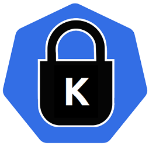

# Konstraint

[](https://goreportcard.com/report/github.com/plexsystems/konstraint)



Konstraint is a CLI tool to assist with the creation and management of constraints when using [Gatekeeper](https://github.com/open-policy-agent/gatekeeper).

## Why this tool exists

### Automatically copy Rego to the ConstraintTemplate

When writing policies for Gatekeeper, the Rego must be added to [ConstraintTemplates](https://github.com/open-policy-agent/gatekeeper#constraint-templates) in order for Gatekeeper to enforce the policy. This creates a scenario in which the Rego is written in a `.rego` file, and then copied into the ConstraintTemplate. When a change is needed to be made to the Rego, both instances must be updated.

### Automatically update all ConstraintTemplates with library changes

Gatekeeper supports importing _libraries_ into `ConstraintTemplates` with the `libs` field. If a change is required to the imported library, every template must be updated to include this new change.

### Enable writing the same policies for Conftest and Gatekeeper

With Gatekeeper, policies are evaluated in the context of an [AdmissionReview](https://kubernetes.io/docs/reference/access-authn-authz/extensible-admission-controllers/#webhook-request-and-response). This means that policies are typically written with a prefix of `input.review.object`.

With [Conftest](https://github.com/open-policy-agent/conftest), policies are written against `yaml` files.

This creates a scenario where the policy needs to be written differently depending upon the context in which the policy is being evaluated in.

`Konstraint` aims to:

- Auto-generate both `ConstraintTemplates` and the Constraints themselves. The `.rego` files are the source of truth and all development should happen in those files.

- Auto-generate the documentation for the policies, using the `.rego` files as the source of truth.

- Enable the same policy to be used with Gatekeeper `AdmissionReviews` and Conftest `yaml` files. This is accomplished with the provided libraries.

### Kubernetes Libraries

In the [examples/lib](examples/lib) directory, there are multiple libraries that enable policies to easily be written for both Conftest and Gatekeeper. You can include as little or as many of these libraries into your policies as desired.

#### Purpose

By first validating the Kubernetes manifests with `Conftest` on a local machine, we are able to catch manifests that would otherwise violate policy without needing to deploy to a cluster running Gatekeeper.

## Installation

Once you have executed the below, it will either be installed into your $GOPATH or $HOME/go.

```text
GO111MODULE=on go get github.com/plexsystems/konstraint
```

## Usage

To create the Gatekeeper resources, use `konstraint create <policy_dir>`. To generate the accompanying documentation, use `konstraint doc <policy_dir>`. Both commands support the `--output` flag to specify where to save the output. For more detailed usage documentation, see the [CLI Documentation](docs/cli/konstraint.md).

## FAQ

**Konstraint ran without error, but I don't see any new files.**

This typically means no policies were found, or the policies did not have any `violation[]` rules so they are not compatible with Gatekeeper. For more information, see [How Constraints are Created](docs/constraint_creation.md).
